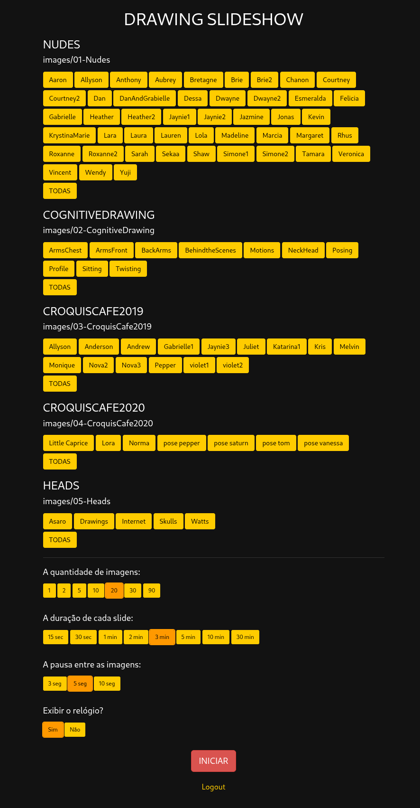

# Drawing Slideshow

Slideshow para prática de desenho. Exibe imagens em sequência com tempo configurável por slide, organizadas em categorias e modelos. Inclui sistema de login, seleção múltipla de modelos, pausa entre imagens, relógio regressivo e opção "Lembrar de mim".



---

## Requisitos

- PHP 8.0+
- Apache ou Nginx com suporte a PHP
- Extensão `session` habilitada (padrão no PHP)

---

## Instalação

```bash
git clone <repo>
cp config.sample.php config.php
```

Edite `config.php` com suas credenciais.

---

## Estrutura de pastas

```
drawing/
├── images/              ← não versionado
│   └── 01-Categoria/
│       └── modelo/
│           └── imagem.jpg
├── css/
│   ├── bootstrap.min.css
│   └── style.css
├── js/
├── fonts/
├── index.php            ← login (não versionado)
├── login.php            ← processa o POST do login (não versionado)
├── gallery.php          ← seleção de modelos e configurações
├── slideshow.php        ← slideshow em si
├── logout.php           ← destrói a sessão
├── session.php          ← valida sessão para requisições AJAX
├── functions.php        ← funções compartilhadas e guard de autenticação
├── config.php           ← credenciais (não versionado)
└── config.sample.php    ← template de configuração
```

### Estrutura de imagens

As imagens devem seguir obrigatoriamente dois níveis de subpastas dentro de `images/`:

```
images/
└── 01-Categoria/
    ├── nome-do-modelo/
    │   ├── foto1.jpg
    │   └── foto2.jpg
    └── outro-modelo/
        └── foto1.jpg
```

- O prefixo numérico (`01-`) controla a ordem de exibição na tela
- Hífens no nome das pastas são convertidos em espaços na interface
- Os três primeiros caracteres do nome da categoria são removidos na exibição (ex: `01-Nudes` → `Nudes`)

---

## Credenciais

Todas as configurações sensíveis ficam em `config.php` (não versionado):

```php
define('SECRET_KEY', 'gere-uma-chave-com-openssl-rand-hex-32');
define('AUTH_USER', 'seu@email.com');
define('AUTH_PASS', 'sua-senha');
```

Gere uma `SECRET_KEY` segura com:

```bash
openssl rand -hex 32
```

> A `SECRET_KEY` assina o cookie de "Lembrar de mim" — troque-a se suspeitar de comprometimento.

---

## Valores padrão do slideshow

Definidos em `functions.php` via cookies. Os padrões aplicados na primeira visita são:

| Parâmetro | Padrão | Descrição                        |
|-----------|--------|----------------------------------|
| `models`  | vazio  | Modelos selecionados (todos)     |
| `qtd`     | 20     | Quantidade de imagens            |
| `time`    | 180    | Duração de cada slide (segundos) |
| `pause`   | 3      | Pausa entre slides (segundos)    |
| `timer`   | yes    | Exibir relógio na tela           |

Para alterar os padrões, edite a função `getCookies()` em `functions.php`.

---

## Permissões de arquivo

```bash
find . -type d -exec chmod 755 {} \;
find . -type f -exec chmod 644 {} \;
```

### Atributos estendidos no macOS

```bash
xattr -rc *
```

---

## Nomes de arquivo

[`fnfix.py`](fnfix.py) renomeia arquivos com caracteres especiais ou incompatíveis com shell Unix. Remove pontuação problemática, converte espaços, e pode aplicar upper/lower case em lote. Útil para normalizar nomes de imagens vindas do Windows ou macOS.

```bash
# Renomear recursivamente para lowercase
./fnfix.py -rL pasta-alvo

# Converter espaços em underscores (dry run)
./fnfix.py -nr -f' ' -t'_' pasta-alvo
```

Autor: [Micah Elliott](http://MicahElliott.com)
